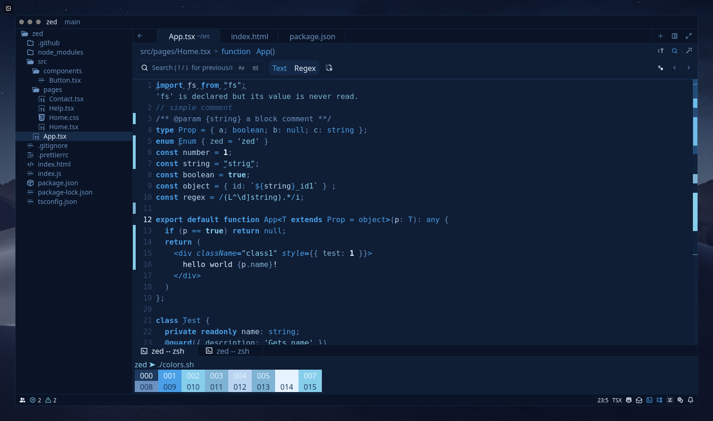

# shadow-energy-zed

A dark blue theme for the Zed text editor inspired by the vibrant energy of a dark blue show.

## Shadow Energy

## Use Locally

To use this theme, copy the contents of `themes/shadow_energy.json` into your `~/.config/zed/themes` folder.

See https://zed.dev/docs/themes?highlight=themes#themes for more info.
